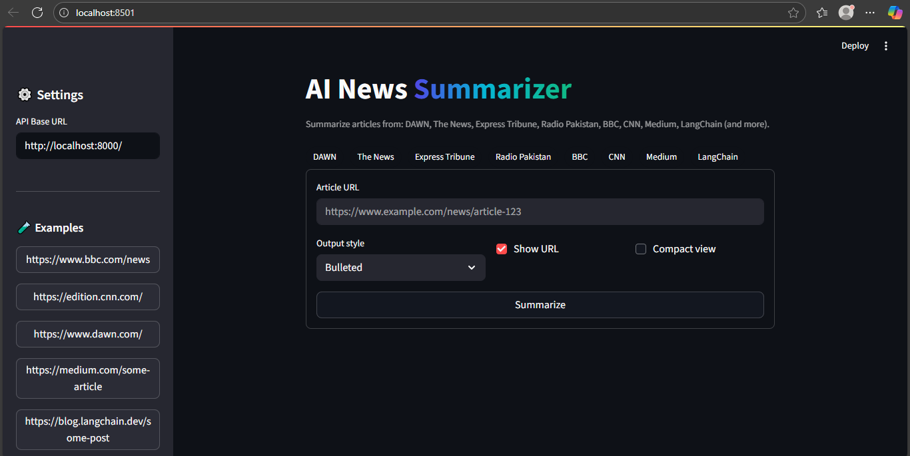
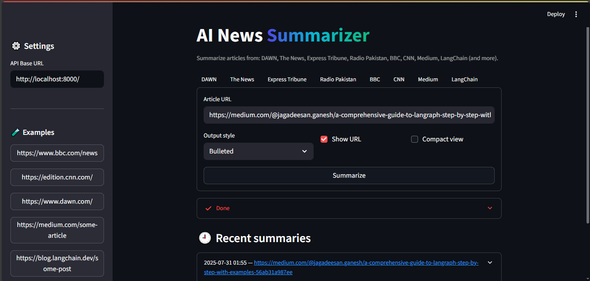
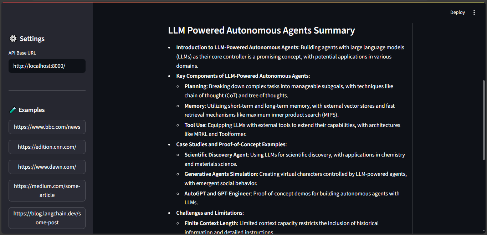

# &#x20;News Article Summarizer using Llama-3 and Langchain

## Project Overview

This project is a **news article summarization tool** that leverages **Meta's Llama 3**, **Langchain**, and **FastAPI/Streamlit** to extract, summarize, and display news content from a given URL. It includes two UI options:

* **Streamlit App** for user-friendly interaction.
* **FastAPI Backend** for scalable deployment and API usage.

## Features

* Input a URL and extract full article content using `newspaper3k`
* Generate high-quality summaries using **Llama 3 via Nebius API**
* Modular summarization chain with Langchain
* FastAPI and Streamlit interfaces
* UI Screenshots: `media/screen_1.png`, `screen_2.png`, `screen_3.png`

## Project Structure

```
NEWS_ARTICLE_SUMMARIZER/
├── .env
├── app.py                      # Streamlit app entry point
├── server.py                   # FastAPI server entry point
├── requirements.txt
├── utils/
│   ├── import_llama3.py        # Wrapper for Llama 3 model loading via Nebius
│   ├── summarization_chain.py  # Langchain summarization logic
│   └── summary_generation.py   # High-level function for summarization
├── media/
│   ├── screen_1.png
│   ├── screen_2.png
│   └── screen_3.png
```

## Setup & Usage

### 1. Clone the Repository

```bash
git clone https://github.com/your-username/NEWS_ARTICLE_SUMMARIZER.git
cd NEWS_ARTICLE_SUMMARIZER
```

### 2. Create Virtual Environment

```bash
python -m venv .venv
source .venv/bin/activate     # On Windows: .venv\Scripts\activate
```

### 3. Install Dependencies

```bash
pip install -r requirements.txt
```

### 4. Setup Environment Variables

Create a `.env` file in the root directory:

```
NEBIUS_API_KEY=your_api_key_here
```

### 5. Run Streamlit UI

```bash
streamlit run app.py
```

### 6. Run FastAPI Server

```bash
uvicorn server:app --reload
```

## &#x20;Tech Stack

* **Python 3.10+**
* **Llama 3 via Nebius API**
* **Langchain** for summarization chains
* **Newspaper3k** for article parsing
* **FastAPI** for backend
* **Streamlit** for frontend

---

## Demo

Screenshots for demo are stored in `/media`:

* `screen_1.png`: 
* `screen_2.png`: 
* `screen_3.png`: 

